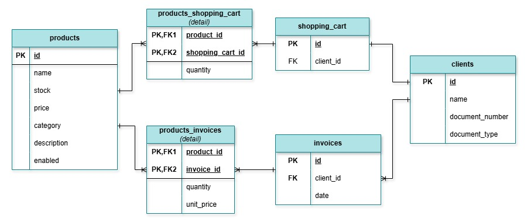
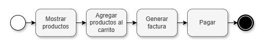

# poc-java-app-ecommerce

---

 # ✅ Enpoints para productos

### Consultar todos los productos: ✅
```bash
echo get/products | ncat localhost 8081 | jq
```


### Consultar un producto por su ID: ✅
```bash
echo get/products/1 | ncat localhost 8081 | jq
```

### Consultar productos por categoría: ✅
```bash
echo get/products?category=Accessories | ncat localhost 8081 | jq
```

### Consultar productos con un precio menor a: ✅
```bash
echo get/products?lessThanPrice=145 | ncat localhost 8081 | jq
```

### Consultar productos que incluyan la palabra: ✅
```bash
echo get/products?nameMatches=phone | ncat localhost 8081 | jq
```

### Eliminar un producto por su ID: ✅
```bash
echo delete/products/1 | ncat localhost 8081
```

### Guardar un nuevo producto: ✅
```bash
echo post/products/ew0KCSJuYW1lIjogIkF1ZMOtZm9ub3MiLA0KCSJzdG9jayI6IDE1LA0KCSJ1bml0UHJpY2UiOiAxMzkuOTksDQoJImNhdGVnb3J5IjogIlRlY2hub2xvZ3kiLA0KCSJkZXNjcmlwdGlvbiI6ICJBdWTDrWZvbm9zIGdhbWVyIg0KfQ== | ncat localhost 8081
```

<br>

# ✅ Enpoints para carrito de compras

### Consultar carrito de compras: ✅
```bash
echo get/shopping-carts?documentNumber=32165498 | ncat localhost 8081 | jq
```

### Añadir producto al carrito de compras: ✅
Si el producto ya existe en el carrito de compras entonces incrementar su cantidad, sino añadirlo al carrito como un nuevo item.
```bash
echo post/shopping-carts/add-product/ewoJImNsaWVudCI6IHsKCQkiZG9jdW1lbnROdW1iZXIiIDogIjEyMzQ1Njc4IiwKCQkiZG9jdW1lbnRUeXBlIiA6ICIiCgl9LAoJInByb2R1Y3QiOiB7CgkJImlkIjogNSwKCQkicXVhbnRpdHkiOiA3Cgl9Cn0= | ncat localhost 8081
```

### Reducir la cantidad de un producto en el carrito de compras: `To do ❓`
Si la cantidad del producto en el carrito llega a 0, entonces removerlo del carrito.
```bash
echo post/shopping-carts/reduce-product/{base64} | ncat localhost 8081
```

<br>

# ❓ Enpoints para facturas

### Generar nueva factura: `To do ❓`
```bash
echo get/invoices?documentNumber=32165498 | ncat localhost 8081 | jq
```

### Consultar facturas: `To do ❓`
```bash
echo get/invoices?documentNumber=32165498 | ncat localhost 8081 | jq
```

### Consultar facturas por fecha: `To do ❓`
```bash
echo get/invoices?documentNumber=32165498&date=08-05-2025 | ncat localhost 8081 | jq
```


# 📄 Diagrama de base de datos

`products`⭤ `shopping_cars`
- Un carrito de compra puede tener 0 o más productos.
- Un producto puede aparecer en más de un carrito de compra.

`shopping_cars`⭤ `clients`
- Un cliente tiene un carrito de compras.
- Un carrito de compras le pertenece a un cliente.

`products`⭤ `invoices`
- Un producto puede aparecer en 0 o muchas facturas.
- Una factura contiene 1 o más productos.

`clients`⭤ `invoices`
- Un cliente tiene 0 o más facturas.
- Una factura le pertenece a un cliente.



<br>

# 📄 Diagrama de procesos



<br><br><br>

# ⚙️ Tecnologías
- `Lombok`: Simplifica la escritura de código repetitivo.
- `Jackson`: Facilita la conversión entre objetos Java y formato JSON.
- `Google Guice`: Ayuda a manejar la inyección de dependencias.

<br>

# 📌 Pre requisitos

> ### Instalar ncat
> Esta herramienta permitirá ejecutar peticiones con TCP.
> - Descargar e instalar ncat para Windows desde: https://nmap.org/download.html#windows
> - Añadir `ncat` a las variables de entorno.

> ### Instalar jq
> Esta herramienta dará formato a las respuestas JSON.
> ```shell
> choco install jq
> ```


> ### Construir artefacto
> ```bash
> mvn clean install
> ```

